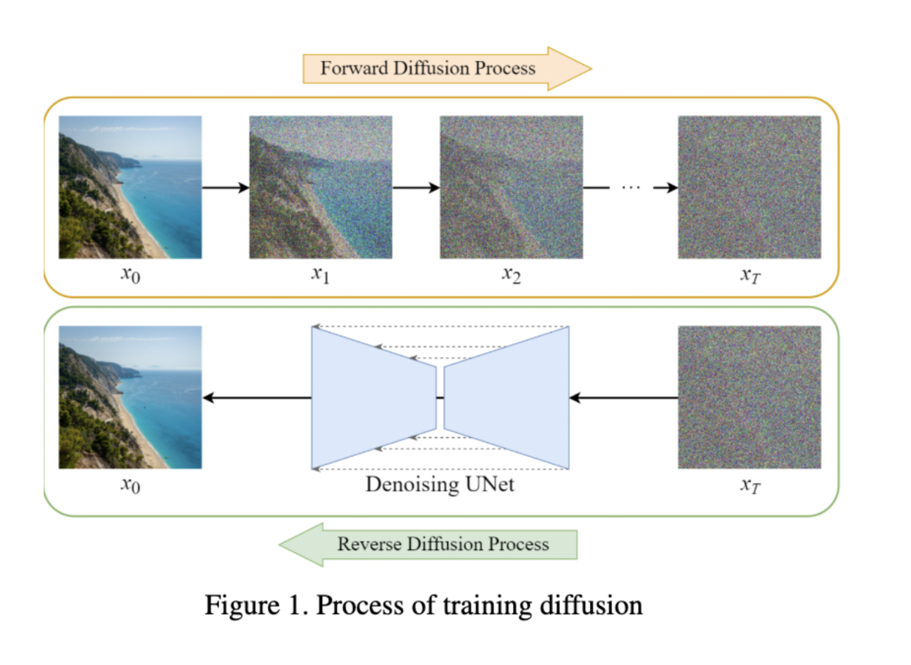
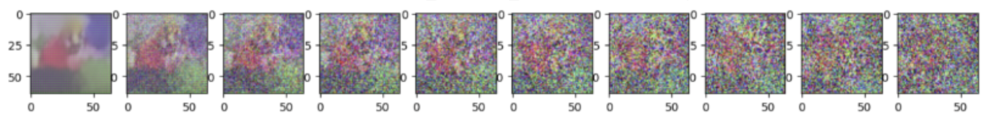

# Simple Diffusion: Generating Realistic Images with Diffusion Methods

## Overview

**Simple Diffusion** is an AI project aimed at developing a generative model using diffusion methods to produce lifelike floral images. This project focuses on creating a simplified version of ControlNet, integrating conditional control into image diffusion models to enhance image generation processes while maintaining computational efficiency. This project was completed as the final paper for the EECS 442 (Computer Vision) class at the University of Michigan.

## Motivation

Training image diffusion models with additional conditional control and inputs can be resource-intensive and time-consuming, often yielding sub-optimal results. To address these challenges, we propose a strategy centered around the use of ControlNets, which are auxiliary networks trained separately using both small and large datasets. This project aims to reproduce the effectiveness of ControlNet architecture in simpler models to better understand its functionality and improve efficiency in image generation processes.

## Project Goals

- **Develop a Simple Diffusion Model**: Create a generative AI model using diffusion methods to produce high-quality images.
- **Enhance Model Efficacy**: Experiment with various weight initializations, activation functions, and architectural optimizations.
- **Integrate Conditional Control**: Implement ControlNet to improve the efficiency and stability of the image generation process.
- **Refine Diffusion Model**: Use the Oxford Flowers 102 dataset to train and refine the model, focusing on generating realistic floral images.

## Methodology

1. **Data Preprocessing**: 
   - Resized images to 64x64 resolution.
   - Applied random flips for data augmentation.
   - Rescaled image data from [0, 255] to [-1, 1].

2. **Model Architecture**: 
   - Integrated a closed-form forward diffusion process with a UNet-based model.
   - Utilized a sinusoidal timestep embedding for shared parameters across time.
   - Implemented systematic loss calculation and optimization using the Adam optimizer.

3. **Training and Improvements**:
   - Initial training on a smaller dataset for quicker iterations.
   - Applied Xavier Uniform distribution for weight initialization.
   - Experimented with ReLU and LeakyReLU activation functions.
   - Increased model depth for processing complex details.
   - Multiplied residual connections by a constant value to improve results.

## Results

- **Initial Model**: Generated images were blurry with muted colors. Loss converged around 0.15.
- **Improved Model**: Enhanced color vibrancy and edge definition. Loss converged around 0.12. Generated realistic-looking flowers with visible structural features such as petals, leaves, and stamen.

## Future Work

- **Attention Mechanisms**: Incorporate self-attention mechanisms to enhance the model’s ability to capture long-range dependencies and spatial relationships.
- **Patch Diffusion**: Explore the Patch Diffusion framework for faster and more data-efficient training.

## Visual Results

**Training Diffusion Process:**

**Generated Image Results:**

## References

1. Zhang, L., Rao, A., & Agrawala, M. (2023). Adding conditional control to text-to-image diffusion models. In Proceedings of the IEEE/CVF International Conference on Computer Vision (pp. 3836-3847).
2. Ho, J., Jain, A., & Abbeel, P. (2020). Denoising diffusion probabilistic models. Advances in neural information processing systems, 33, 6840-6851.
3. Dhariwal, P., & Nichol, A. (2021). Diffusion models beat GANs on image synthesis. Advances in neural information processing systems, 34, 8780-8794.
4. Wang, Z., Jiang, Y., Zheng, H., Wang, P., He, P., Wang, Z., & Zhou, M. (2023). Patch diffusion: Faster and more data-efficient training of diffusion models. arXiv preprint arXiv:2304.12526.

---

By Ezequiel Cutin, Jason Zhang, Aarti Phatke, and Bo Pang

University of Michigan
